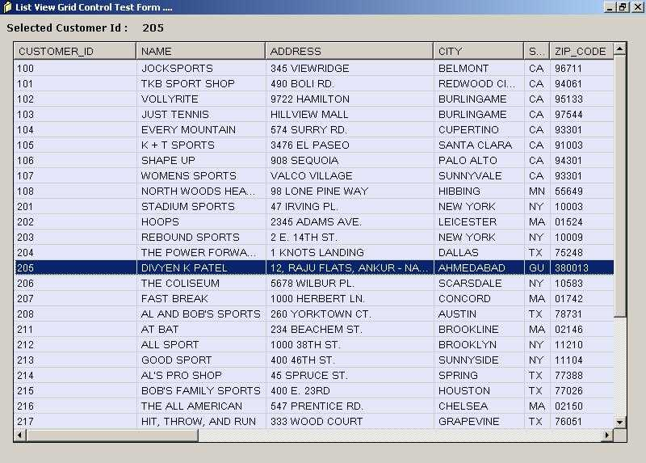



## List View Data Grid Control

### Description

Just pass Connection String and Query String and Get Data in the List View
 
### More Info
 
Connection String and Query String

Data in List View Control

             |
---                |---
**Submitted On**   |2003-08-04 14:36:56
**By**             |[Divyen Patel](https://github.com/Planet-Source-Code/PSCIndex/blob/master/ByAuthor/divyen-patel.md)
**Level**          |Intermediate
**User Rating**    |4.7 (14 globes from 3 users)
**Compatibility**  |VB 6\.0
**Category**       |[Custom Controls/ Forms/  Menus](https://github.com/Planet-Source-Code/PSCIndex/blob/master/ByCategory/custom-controls-forms-menus__1-4.md)
**World**          |[Visual Basic](https://github.com/Planet-Source-Code/PSCIndex/blob/master/ByWorld/visual-basic.md)
**Archive File**   |[List\_View\_162393842003\.zip](https://github.com/Planet-Source-Code/divyen-patel-list-view-data-grid-control__1-47385/archive/master.zip)

